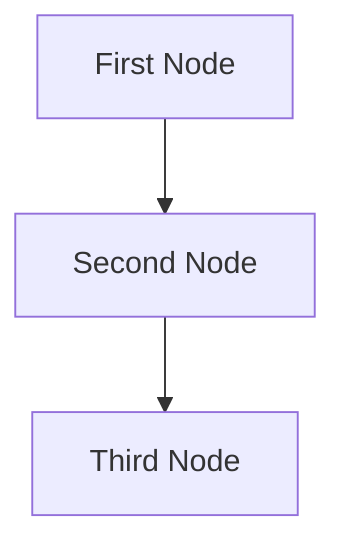

# Design Doc: IELTS Writing Scoring Criterial Agent

> Please DON'T remove notes for AI

## Requirements
I. General System Requirements & Core Knowledge (Applicable to both Tasks)
Understanding of IELTS Band Descriptors:
The agent must have an internal representation or model of the official IELTS Writing Band Descriptors (for Bands 0-9) for all four criteria.
It must be able to differentiate the nuanced language used to describe performance at each band level for each criterion.
Input Processing:
Ability to accept text input (e.g., typed, pasted, potentially uploaded .txt or .docx).
Basic text cleaning (e.g., handling strange characters, multiple spaces) without altering original meaning or errors relevant to scoring (like spelling).
Output Requirements:
Provide an overall band score (e.g., 6.0, 6.5, 7.0).
Provide individual band scores for each of the four criteria.
Provide specific, actionable feedback linked to the band descriptors, explaining why a certain score was given for each criterion.
Highlight areas of strength and weakness.
(Optional but highly valuable) Suggest specific ways to improve.
(Optional) Identify and categorize grammatical errors, spelling mistakes, and punctuation errors.
Word Count Calculation:
Accurately calculate the word count according to IELTS rules (e.g., hyphenated words, numbers).
Know the penalty implications for being under the word limit (150 for Task 1, 250 for Task 2).
Plagiarism/Memorization Detection (Advanced):
(Optional, advanced) Capability to detect if parts of the response are likely memorized phrases or plagiarized content, which can negatively impact scores.
Natural Language Understanding (NLU) Capabilities:
Semantic Understanding: Grasp the meaning of sentences and paragraphs.
Syntactic Analysis: Parse sentence structures.
Discourse Analysis: Understand how ideas are connected across the text.
Lexical Analysis: Analyze vocabulary usage.
II. Knowledge for Scoring IELTS Writing Task 1 (Report Writing)

### Band 9
**Task Achievement**
- All the requirements of the task are fully and appropriately satisfied
- There may be extremely rare lapses in content

**Coherence and Cohesion**
- The message can be followed effortlessly
- Cohesion is used in such a way that it very rarely attracts attention
- Any lapses in coherence or cohesion are minimal
- Paragraphing is skilfully managed

**Lexical Resource**
- Full flexibility and precise use are evident within the scope of the task
- A wide range of vocabulary is used accurately and appropriately with very natural and sophisticated control of lexical features
- Minor errors in spelling and word formation are extremely rare and have minimal impact on communication

**Grammatical Range and Accuracy**
- A wide range of structures within the scope of the task is used with full flexibility and control
- Punctuation and grammar are used appropriately throughout
- Minor errors are extremely rare and have minimal impact on communication

### Band 8
**Task Achievement**
- The response covers all the requirements of the task appropriately, relevantly and sufficiently
- (Academic) Key features are skilfully selected, and clearly presented, highlighted and illustrated
- (General Training) All bullet points are clearly presented, and appropriately illustrated or extended
- There may be occasional omissions or lapses in content

**Coherence and Cohesion**
- The message can be followed with ease
- Information and ideas are logically sequenced, and cohesion is well managed
- Occasional lapses in coherence or cohesion may occur
- Paragraphing is used sufficiently and appropriately

**Lexical Resource**
- A wide resource is fluently and flexibly used to convey precise meanings within the scope of the task
- There is a skilful use of uncommon and/or idiomatic items when appropriate, despite occasional inaccuracies in word choice and collocation
- Occasional errors in spelling and/or word formation may occur, but have minimal impact on communication

**Grammatical Range and Accuracy**
- A wide range of structures within the scope of the task is flexibly and accurately used
- The majority of sentences are error-free, and punctuation is well managed
- Occasional, non-systematic errors and inappropriacies occur, but have minimal impact on communication

### Band 7
**Task Achievement**
- The response covers the requirements of the task
- The content is relevant and accurate – there may be a few omissions or lapses. The format is appropriate
- (Academic) Key features which are selected are covered and clearly highlighted but could be more fully or more appropriately illustrated or extended
- (Academic) It presents a clear overview, the data are appropriately categorised, and main trends or differences are identified
- (General Training) All bullet points are covered and clearly highlighted but could be more fully or more appropriately illustrated or extended. It presents a clear purpose. The tone is consistent and appropriate to the task. Any lapses are minimal

**Coherence and Cohesion**
- Information and ideas are logically organised and there is a clear progression throughout the response. A few lapses may occur
- A range of cohesive devices including reference and substitution is used flexibly but with some inaccuracies or some over/under use

**Lexical Resource**
- The resource is sufficient to allow some flexibility and precision
- There is some ability to use less common and/or idiomatic items
- An awareness of style and collocation is evident, though inappropriacies occur
- There are only a few errors in spelling and/or word formation, and they do not detract from overall clarity

**Grammatical Range and Accuracy**
- A variety of complex structures is used with some flexibility and accuracy
- Grammar and punctuation are generally well controlled, and error-free sentences are frequent
- A few errors in grammar may persist, but these do not impede communication

### Band 6
**Task Achievement**
- The response focuses on the requirements of the task and an appropriate format is used
- (Academic) Key features which are selected are covered and adequately highlighted. A relevant overview is attempted. Information is appropriately selected and supported using figures/data
- (General Training) All bullet points are covered and adequately highlighted. The purpose is generally clear. There may be minor inconsistencies in tone
- Some irrelevant, inappropriate or inaccurate information may occur in areas of detail or when illustrating or extending the main points
- Some details may be missing (or excessive) and further extension or illustration may be needed

**Coherence and Cohesion**
- Information and ideas are generally arranged coherently and there is a clear overall progression
- Cohesive devices are used to some good effect but cohesion within and/or between sentences may be faulty or mechanical due to misuse, overuse or omission
- The use of reference and substitution may lack flexibility or clarity and result in some repetition or error

**Lexical Resource**
- The resource is generally adequate and appropriate for the task
- The meaning is generally clear in spite of a rather restricted range or a lack of precision in word choice
- If the writer is a risk-taker, there will be a wider range of vocabulary used but higher degrees of inaccuracy or inappropriacy
- There are some errors in spelling and/or word formation, but these do not impede communication

**Grammatical Range and Accuracy**
- A mix of simple and complex sentence forms is used but flexibility is limited
- Examples of more complex structures are not marked by the same level of accuracy as in simple structures
- Errors in grammar and punctuation occur, but rarely impede communication

### Band 5
**Task Achievement**
- The response generally addresses the requirements of the task. The format may be inappropriate in places
- (Academic) Key features which are selected are not adequately covered. The recounting of detail is mainly mechanical. There may be no data to support the description
- (General Training) All bullet points are presented but one or more may not be adequately covered. The purpose may be unclear at times. The tone may be variable and sometimes inappropriate
- There may be a tendency to focus on details (without referring to the bigger picture)
- The inclusion of irrelevant, inappropriate or inaccurate material in key areas detracts from the task achievement
- There is limited detail when extending and illustrating the main points

**Coherence and Cohesion**
- Organisation is evident but is not wholly logical and there may be a lack of overall progression. Nevertheless, there is a sense of underlying coherence to the response
- The relationship of ideas can be followed but the sentences are not fluently linked to each other
- There may be limited/overuse of cohesive devices with some inaccuracy
- The writing may be repetitive due to inadequate and/or inaccurate use of reference and substitution

**Lexical Resource**
- The resource is limited but minimally adequate for the task
- Simple vocabulary may be used accurately but the range does not permit much variation in expression
- There may be frequent lapses in the appropriacy of word choice, and a lack of flexibility is apparent in frequent simplifications and/or repetitions
- Errors in spelling and/or word formation may be noticeable and may cause some difficulty for the reader

**Grammatical Range and Accuracy**
- The range of structures is limited and rather repetitive
- Although complex sentences are attempted, they tend to be faulty, and the greatest accuracy is achieved on simple sentences
- Grammatical errors may be frequent and cause some difficulty for the reader
- Punctuation may be faulty

### Band 4
**Task Achievement**
- The response is an attempt to address the task
- (Academic) Few key features have been selected
- (General Training) Not all bullet points are presented
- (General Training) The purpose of the letter is not clearly explained and may be confused. The tone may be inappropriate
- The format may be inappropriate
- Key features/bullet points which are presented may be irrelevant, repetitive, inaccurate or inappropriate

**Coherence and Cohesion**
- Information and ideas are evident but not arranged coherently, and there is no clear progression within the response
- Relationships between ideas can be unclear and/or inadequately marked. There is some use of basic cohesive devices, which may be inaccurate or repetitive
- There is inaccurate use or a lack of substitution or referencing

**Lexical Resource**
- The resource is limited and inadequate for or unrelated to the task. Vocabulary is basic and may be used repetitively
- There may be inappropriate use of lexical chunks (e.g. memorised phrases, formulaic language and/or language from the input material)
- Inappropriate word choice and/or errors in word formation and/or in spelling may impede meaning

**Grammatical Range and Accuracy**
- A very limited range of structures is used
- Subordinate clauses are rare and simple sentences predominate
- Some structures are produced accurately but grammatical errors are frequent and may impede meaning
- Punctuation is often faulty or inadequate

### Band 3
**Task Achievement**
- The response does not address the requirements of the task (possibly because of misunderstanding of the data/diagram/situation)
- Key features/bullet points which are presented may be largely irrelevant
- Limited information is presented, and this may be used repetitively

**Coherence and Cohesion**
- There is no apparent logical organisation. Ideas are discernible but difficult to relate to each other
- Minimal use of sequencers or cohesive devices. Those used do not necessarily indicate a logical relationship between ideas
- There is difficulty in identifying referencing

**Lexical Resource**
- The resource is inadequate (which may be due to the response being significantly underlength)
- Possible over-dependence on input material or memorised language
- Control of word choice and/or spelling is very limited, and errors predominate. These errors may severely impede meaning

**Grammatical Range and Accuracy**
- Sentence forms are attempted, but errors in grammar and punctuation predominate (except in memorised phrases or those taken from the input material). This prevents most meaning from coming through
- Length may be insufficient to provide evidence of control of sentence forms

### Band 2
**Task Achievement**
- The content barely relates to the task

**Coherence and Cohesion**
- There is little relevant message, or the entire response may be off-topic
- There is little evidence of control of organisational features

**Lexical Resource**
- The resource is extremely limited with few recognisable strings, apart from memorised phrases
- There is no apparent control of word formation and/or spelling

**Grammatical Range and Accuracy**
- There is little or no evidence of sentence forms (except in memorised phrases)

### Band 1
**Task Achievement**
- Responses of 20 words or fewer are rated at Band 1
- The content is wholly unrelated to the task
- Any copied rubric must be discounted

**Coherence and Cohesion**
- Responses of 20 words or fewer are rated at Band 1
- The writing fails to communicate any message and appears to be by a virtual non-writer

**Lexical Resource**
- Responses of 20 words or fewer are rated at Band 1
- No resource is apparent, except for a few isolated words

**Grammatical Range and Accuracy**
- Responses of 20 words or fewer are rated at Band 1
- No rateable language is evident

### Band 0
**All Criteria**
- Should only be used where a candidate did not attend or attempt the question in any way, used a language other than English throughout, or where there is proof that a candidate's answer has been totally memorised

III. Knowledge for Scoring IELTS Writing Task 2 (Essay Writing)

### Band 9
**Task Achievement**
- All the requirements of the task are fully and appropriately satisfied
- Extremely rare lapses in content, if any

**Coherence and Cohesion**
- The message can be followed effortlessly
- Cohesion is used in such a way that it very rarely attracts attention
- Any lapses in coherence or cohesion are minimal
- Paragraphing is skilfully managed

**Lexical Resource**
- Full flexibility and precise use are evident within the scope of the task
- A wide range of vocabulary is used accurately and appropriately with very natural and sophisticated control of lexical features
- Minor errors in spelling and word formation are extremely rare and have minimal impact on communication

**Grammatical Range and Accuracy**
- A wide range of structures within the scope of the task is used with full flexibility and control
- Punctuation and grammar are used appropriately throughout
- Minor errors are extremely rare and have minimal impact on communication

### Band 8
**Task Achievement**
- The response covers all the requirements of the task appropriately, relevantly and sufficiently
- There may be occasional omissions or lapses in content

**Coherence and Cohesion**
- The message can be followed with ease
- Information and ideas are logically sequenced, and cohesion is well managed
- Occasional lapses in coherence or cohesion may occur
- Paragraphing is used sufficiently and appropriately

**Lexical Resource**
- A wide resource is fluently and flexibly used to convey precise meanings within the scope of the task
- There is a skilful use of uncommon and/or idiomatic items when appropriate, despite occasional inaccuracies in word choice and collocation
- Occasional errors in spelling and/or word formation may occur, but have minimal impact on communication

**Grammatical Range and Accuracy**
- A wide range of structures within the scope of the task is flexibly and accurately used
- The majority of sentences are error-free, and punctuation is well managed
- Occasional, non-systematic errors and inappropriacies occur, but have minimal impact on communication

### Band 7
**Task Achievement**
- The response covers the requirements of the task
- The content is relevant and accurate – there may be a few omissions or lapses
- The format is appropriate

**Coherence and Cohesion**
- Information and ideas are logically organised and there is a clear progression throughout the response. A few lapses may occur
- A range of cohesive devices including reference and substitution is used flexibly but with some inaccuracies or some over/under use

**Lexical Resource**
- The resource is sufficient to allow some flexibility and precision
- There is some ability to use less common and/or idiomatic items
- An awareness of style and collocation is evident, though inappropriacies occur
- There are only a few errors in spelling and/or word formation, and they do not detract from overall clarity

**Grammatical Range and Accuracy**
- A variety of complex structures is used with some flexibility and accuracy
- Grammar and punctuation are generally well controlled, and error-free sentences are frequent
- A few errors in grammar may persist, but these do not impede communication

### Band 6
**Task Achievement**
- The response focuses on the requirements of the task and an appropriate format is used
- Some irrelevant, inappropriate or inaccurate information may occur in areas of detail or when illustrating or extending the main points
- Some details may be missing (or excessive) and further extension or illustration may be needed

**Coherence and Cohesion**
- Information and ideas are generally arranged coherently and there is a clear overall progression
- Cohesive devices are used to some good effect but cohesion within and/or between sentences may be faulty or mechanical due to misuse, overuse or omission
- The use of reference and substitution may lack flexibility or clarity and result in some repetition or error

**Lexical Resource**
- The resource is generally adequate and appropriate for the task
- The meaning is generally clear in spite of a rather restricted range or a lack of precision in word choice
- If the writer is a risk-taker, there will be a wider range of vocabulary used but higher degrees of inaccuracy or inappropriacy
- There are some errors in spelling and/or word formation, but these do not impede communication

**Grammatical Range and Accuracy**
- A mix of simple and complex sentence forms is used but flexibility is limited
- Examples of more complex structures are not marked by the same level of accuracy as in simple structures
- Errors in grammar and punctuation occur, but rarely impede communication

### Band 5 and Below
**Task Achievement**
- The response generally addresses the requirements of the task but may have inappropriate format, inadequate coverage of key features, irrelevant material, or mechanical recounting of detail
- At lower bands, the response may not address the requirements of the task, have irrelevant content, or be severely underlength

**Coherence and Cohesion**
- Organization may not be wholly logical with issues in progression, cohesive devices, and referencing
- At lower bands, there may be no apparent logical organization, minimal use of cohesive devices, or difficulty identifying referencing

**Lexical Resource**
- The resource may be limited but minimally adequate, with simple vocabulary, frequent lapses in word choice, and noticeable errors
- At lower bands, the resource may be inadequate, with over-dependence on memorized language, limited control, and errors that impede meaning

**Grammatical Range and Accuracy**
- The range of structures may be limited and repetitive, with errors that may cause difficulty for the reader
- At lower bands, there may be very limited range of structures, frequent errors that impede meaning, or insufficient evidence of language control

### Brand 4
**Task achievement**
The response is an attempt to address the task.

(Academic) Few key features have been selected.

(General Training) Not all bullet points are presented.

(General Training) The purpose of the letter is not clearly explained and may be confused.The tone may be inappropriate.

The format may be inappropriate.

Key features/bullet points which are presented may be irrelevant, repetitive, inaccurate or inappropriate.

**Coherence and cohesion**
Information and ideas are evident but not arranged coherently, and there is no clear progression within the response.

Relationships between ideas can be unclear and/or inadequately marked. There is some use of basic cohesive devices, which may be inaccurate or repetitive.

There is inaccurate use or a lack of substitution or referencing

**Lexical resource**
The resource is limited and inadequate for or unrelated to the task. Vocabulary is basic and may be used repetitively.

There may be inappropriate use of lexical chunks (e.g. memorised phrases, formulaic language and/or language from the input material).

Inappropriate word choice and/or errors in word formation and/or in spelling may impede meaning

**Grammatical range and accuracy**
A very limited range of structures is used.

Subordinate clauses are rare and simple sentences predominate.

Some structures are produced accurately but grammatical errors are frequent and may impede meaning.

Punctuation is often faulty or inadequate

### Brand 3
**Task achievement**
The response does not address the requirements of the task (possibly because of misunderstanding of the data/diagram/situation).

Key features/bullet points which are presented may be largely irrelevant.

Limited information is presented, and this may be used repetitively

**Coherence and cohesion**
There is no apparent logical organisation. Ideas are discernible but difficult to relate to each other.

Minimal use of sequencers or cohesive devices. Those used do not necessarily indicate a logical relationship between ideas.

There is difficulty in identifying referencing.

**Lexical resource**
The resource is inadequate (which may be due to the response being significantly underlength).

Possible over-dependence on input material or memorised language.

Control of word choice and/or spelling is very limited, and errors predominate. These errors may severely impede meaning.

**Grammatical range and accuracy**
Sentence forms are attempted, but errors in grammar and punctuation predominate (except in memorised phrases or those taken from the input material). This prevents most meaning from coming through.

Length may be insufficient to provide evidence of control of sentence forms.

### Brand 2
**Task achievement**
The content barely relates to the task.

**Coherence and cohesion**
There is little relevant message, or the entire response may be off-topic.

There is little evidence of control of organisational features.

**Lexical resource**
The resource is extremely limited with few recognisable strings, apart from memorised phrases.

There is no apparent control of word formation and/or spelling.

**Grammatical range and accuracy**
There is little or no evidence of sentence forms (except in memorised phrases).

### Brand 1
**Task achievement**
Responses of 20 words or fewer are rated at Band 1.

The content is wholly unrelated to the task.

Any copied rubric must be discounted.

**Coherence and cohesion**
Responses of 20 words or fewer are rated at Band 1.

The writing fails to communicate any message and appears to be by a virtual non-writer.

**Lexical resource**
Responses of 20 words or fewer are rated at Band 1.

No resource is apparent, except for a few isolated words.

**Grammatical range and accuracy**
Responses of 20 words or fewer are rated at Band 1.

No rateable language is evident

### Brand 0 
**All Criteria**
Should only be used where a candidate did not attend or attempt the question in any way, used a language other than English throughout, or where there is proof that a candidate’s answer has been totally memorised.

IV. Data Requirements for AI Training (Crucial for the AI to "Learn")
A very large, diverse dataset of IELTS Task 1 and Task 2 scripts.
These scripts must be accurately scored by certified IELTS examiners (ideally multiple examiners per script for inter-rater reliability).
Scores should be available for overall band and for each of the four criteria.
(Ideal) Scripts should be annotated with specific errors, strengths, and feedback corresponding to the band descriptors. This is key for the AI to learn why a script gets a certain score.
Data should cover a wide range of band scores, topics, and writer proficiency levels.
V. Important Considerations for the AI Agent:
Holistic Scoring vs. Rule-Based: While the AI needs to "know" the rules, IELTS scoring is ultimately holistic. The AI should aim to mimic this, not just count errors.
Avoiding Bias: The training data must be diverse to prevent the AI from being biased against certain writing styles or backgrounds (as long as they fall within acceptable academic English).

## Implementation Approach

### Flow Design
The IELTS Writing Scoring CREtical Agent follows a simple sequential flow pattern:


### Node Implementation

1. **GetIELTSSubmissionNode**:
   - Collects task type (1 or 2), writing prompt, and essay from the user
   - Calculates word count
   - Stores submission in a structured format

2. **IELTSScoreNode**:
   - Selects appropriate prompt template based on task type
   - Formats prompt with submission details
   - Calls LLM to evaluate the essay
   - Parses JSON response into structured score data

3. **DisplayScoreNode**:
   - Formats score data into a readable report
   - Displays overall band score, criteria scores, strengths, areas for improvement, and suggestions

### Utility Functions

1. **count_words**:
   - Accurately counts words in the essay
   - Handles special characters and extra spaces

2. **extract_json_from_llm_response**:
   - Extracts and parses JSON from LLM response
   - Handles potential formatting issues

### Data Models

1. **IELTSTask1Criteria** and **IELTSTask2Criteria**:
   - Store scores for each criterion (0-9 scale)
   - Calculate overall band score

2. **IELTSFeedback**:
   - Store strengths, areas for improvement, and suggestions

3. **IELTSTask1Score** and **IELTSTask2Score**:
   - Combine criteria scores and feedback
   - Include overall band score

4. **IELTSWritingSubmission**:
   - Store task type, prompt, essay, and word count
Continuous Learning: The AI should ideally be updatable as IELTS guidelines evolve or as more training data becomes available.
Explainability: The agent's reasoning for a score should be as transparent as possible to the user.

> Notes for AI: Keep it simple and clear.
> If the requirements are abstract, write concrete user stories


## Flow Design

> Notes for AI:
> 1. Consider the design patterns of agent, map-reduce, rag, and workflow. Apply them if they fit.
> 2. Present a concise, high-level description of the workflow.

### Applicable Design Pattern:

1. Map the file summary into chunks, then reduce these chunks into a final summary.
2. Agentic file finder
   - *Context*: The entire summary of the file
   - *Action*: Find the file

### Flow high-level Design:

1. **First Node**: This node is for ...
2. **Second Node**: This node is for ...
3. **Third Node**: This node is for ...


## Utility Functions

> Notes for AI:
> 1. Understand the utility function definition thoroughly by reviewing the doc.
> 2. Include only the necessary utility functions, based on nodes in the flow.

1. **Call LLM** (`utils/call_llm.py`)
   - *Input*: prompt (str)
   - *Output*: response (str)
   - Generally used by most nodes for LLM tasks

2. **Embedding** (`utils/get_embedding.py`)
   - *Input*: str
   - *Output*: a vector of 3072 floats
   - Used by the second node to embed text

## Node Design

### Shared Store

> Notes for AI: Try to minimize data redundancy

The shared store structure is organized as follows:

```python
shared = {
    "key": "value"
}
```

### Node Steps

> Notes for AI: Carefully decide whether to use Batch/Async Node/Flow.

1. First Node
  - *Purpose*: Provide a short explanation of the node’s function
  - *Type*: Decide between Regular, Batch, or Async
  - *Steps*:
    - *prep*: Read "key" from the shared store
    - *exec*: Call the utility function
    - *post*: Write "key" to the shared store

2. Second Node
  ...

